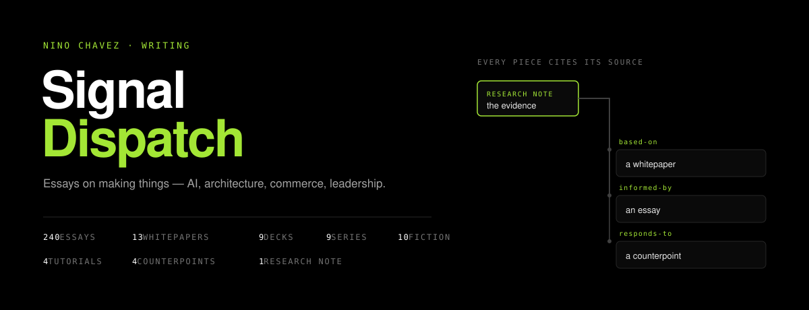

Signal Dispatch is a writing site. This is what it's built out of.

**Read it at [ninochavez.co/blog](https://ninochavez.co/blog).**

## Content declares its own evidence

The thing worth stealing from this repo is the provenance schema. Blog posts, whitepapers and
presentations don't just cite a source in prose — they declare the research that supports
them, and *how*:

```yaml
supportedBy:
  - slug: the-cognitive-foundry
    relationship: based-on      # the piece is derived from this research
  - slug: lie-surface
    relationship: responds-to   # the piece argues against it
```

Four relationships, defined in `astro-build/src/content.config.ts`: `based-on`,
`informed-by`, `responds-to`, `extends`. They render as real links between pieces, so a
reader can walk from an argument back to what it rests on.

The reason it exists: an essay is easy to write and hard to check later. Typing the
relationship means a claim's support is structural rather than remembered, and a research
note that gets revised surfaces every piece standing on it.

## Eight collections, one schema family

| Collection | Count | What it is |
|---|---:|---|
| `blog` | 240 | Essays |
| `whitepapers` | 13 | Long-form research |
| `presentations` | 9 | MDX slide decks, rendered in-browser |
| `series` | 9 | Multi-part arcs |
| `fiction` | 10 | Short fiction |
| `tutorials` | 4 | Step-by-step |
| `counterpoints` | 4 | Arguments against a previous piece |
| `research-notes` | 1 | The evidence other pieces cite |

Presentations are worth a look — they're MDX, not embeds. `<Slide>`, `<Callout>`,
`<CodeBlock>` compose into a deck that lives in the same content pipeline as everything
else, so a deck and the essay it came from share tags, provenance, and search.

## Stack

Astro with MDX and React islands, Tailwind, `@cf-wasm/og` for social cards, deployed to
**Cloudflare Pages** (project `ninochavez-blog`, build output `astro-build/dist`). Pushing to
`main` is the whole deploy — verified 2026-06-11 by watching a post go live with no manual
step. `blog.ninochavez.co` 301s into `ninochavez.co/blog/`.

```bash
cd astro-build
npm install
npm run dev
```

## Voice

`docs/signal-dispatch-voice-guide.md` is the editorial reference — built from analysis of the
published corpus rather than from aspiration, and it carries a rolling list of phrases retired
for overuse. It's public because the method transfers even though the voice doesn't.

## Using this

No license file, so the default applies: all rights reserved. The writing stays that way —
essays, whitepapers, fiction and decks are &copy; Nino Chavez. If you want to reuse the
provenance schema or the presentation components, ask and the answer is almost certainly yes:
nino@ninochavez.co.
